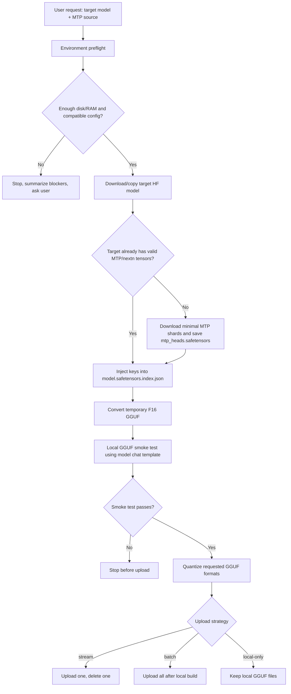

# Qwen MTP GGUF Pipeline Guide

## Pipeline Overview



## Resource Planning

The pipeline estimates peak storage from:

- Target model HF files.
- Minimal MTP source shards.
- Temporary F16 GGUF.
- Requested quantized GGUF outputs.
- Safety margin.

For large models, `stream` is recommended because it keeps only one quantized GGUF live at a time. `batch` is useful when uploads are delayed but requires enough disk for all requested outputs.

## Feasibility Rules

Continue only when:

- llama.cpp converter and quantizer exist.
- Work directory has enough free disk.
- RAM is plausible for conversion/quantization.
- HF token is available for private downloads/uploads.
- Target and MTP source configs match on core architecture fields.
- MTP source index contains `mtp` or `nextn` keys.

The user may override warnings, but config mismatch and disk shortage should be treated as hard blockers unless they explicitly accept the risk.

## Test Strategy

Run a GGUF smoke test before upload:

```bash
python3 scripts/qwen_gguf_smoke_test.py \
  --model ./target-qwen-MTP-F16.gguf \
  --llama-cli ./llama.cpp/build/bin/llama-cli \
  --prompt "State the capital of France in one short sentence." \
  --gpu-layers 0
```

HF-side tests can use:

```python
prompt = processor.apply_chat_template(messages, add_generation_prompt=True, tokenize=False)
inputs = processor(text=[prompt], return_tensors="pt")
```

GGUF-side tests should prefer the chat template embedded in the GGUF metadata or the original `tokenizer_config.json`. Plain Qwen/ChatML text is a fallback for load/generation sanity checks:

```text
<|im_start|>system
You are a helpful AI assistant.<|im_end|>
<|im_start|>user
State the capital of France.<|im_end|>
<|im_start|>assistant
```

For Qwen reasoning models, use the exact tokenizer template and its thinking-control option when judging reasoning behavior. Plain ChatML is enough to catch broken conversion, but not enough to validate reasoning quality.

## Release Checklist

- `preflight_report.md` reviewed.
- `pipeline.log` shows MTP validation and index injection.
- `smoke_*.log` exists and shows successful inference.
- Every expected GGUF file exists locally or remotely.
- Local cleanup happened only after confirmed upload.
- Public README contains no private paths, tokens, or personal repo details.
